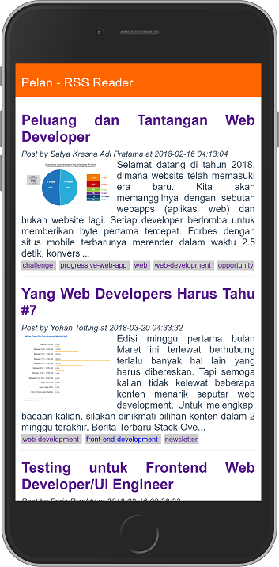

# Pelan

> A Vue PWA RSS Reader (WWWID Challenge)

## Technology
- Vue 2.5 (core javascript framework)
- Vue-router (handling routing)
- Vuex (state management)
- Vue-cli (generator PWA template)
- Firebase Hosting

## Useful Link
- [tantangan wwwid](https://medium.com/wwwid/tantangan-web-developer-untuk-membuat-aplikasi-web-bisa-digunakan-kurang-dari-5-detik-70bb7431741d)
- [source code](https://github.com/hscstudio/vue-pwa)
- [api](https://api.rss2json.com/v1/api.json?rss_url=https%3A%2F%2Fmedium.com%2Ffeed%2Fwwwid)
- tutorial on medium coming soon
- [live demo](https://pelan-76437.firebaseapp.com/)

## Screenshoot

## Build Setup

``` bash
# install dependencies
npm install

# serve with hot reload at localhost:8080
npm run dev

# build for production with minification
npm run build

# build for production and view the bundle analyzer report
npm run build --report
```

Create with love by [Hafid Mukhlasin](http://hafidmukhlasin.com)
